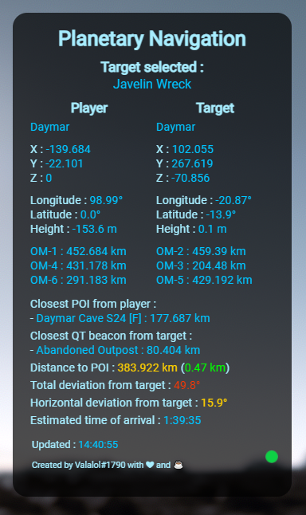
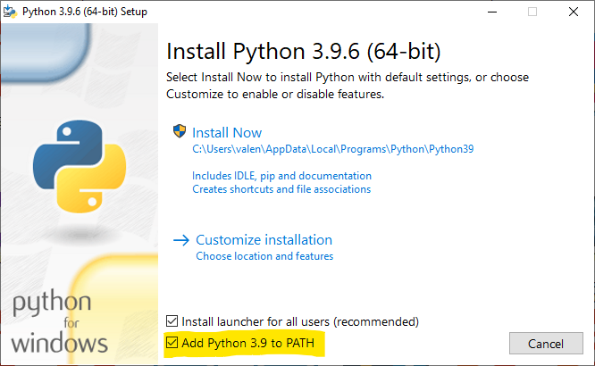

<h1>THIS PROJECT IS PARTLY DEPRECATED, FOR A REPLACEMENT CHECK PROJECT JERICHO AT https://discord.gg/XDVzwZfMmb</h1>

# Star Citizen Navigation

This tool is designed to help you navigate in the universe of Star Citizen.

This project was greatly inspired by the **"Murphy Exploration Group"** and more particularly by **Graupunkt#4414** who carried out a very similar program.

## Table of Contents
1. [General Info](#general-info)
2. [Installation](#installation)
3. [Help](#help)
4. [Contribute](#contribute)
5. [License](#license)

## General Info
This program relies almost entirely on the in-game `/showlocation` command. This command copies the global coordinates (relative to the center of the system) to the clipboard. The tool continuously retrieves the contents of this clipboard and, if coordinates are found, interprets them in order to guide the user to his target.

### Glossary 
- POI = Point Of Interest
- Container = The planets and moons on which the points of interest can be

### Screenshots

## Installation

**First of all, make sure you downloaded a release version and not the source code. Release page is on [this link](https://github.com/Valalol/Star-Citizen-Navigation/releases).**

1) Copy and extract the star-citizen-navigation-tool-win32-x64 folder wherever you want.

2) Install Python from the [Python Download page](https://www.python.org/downloads/). **Make sure the Path box at the bottom right is ticked as shown in the screenshot below**, and let it install with default location and settings.

3) Run the `install.bat` to install the library required by the tool (pyperclip).

4) If everything worked, you should be able to launch the program called `star-citizen-navigation-tool.exe` inside the folder you copied over without issues.

5) After inputting your search selections into the cascading selection  boxes, you will manually need to do a `/showlocation` command from within Starcitizen in order for the map to update.
to do this open the Global chat using `F12`. Hit `enter`, and a command line will open for you. Then simply type in `/showlocation` then `enter`, and the tool will update.

6) If you want the tool to draw your location on a map, run the `Map.exe` and make sure you've done a few commands in-game. The map depends on the main tool to work.

## Help:
If you need some help with the installation and the use of the tool, do not hesitate to create an issue on github, pm me on discord (Valalol#1790), or join the [Meridian Discord Server](https://discord.gg/WMh5YCeQVS) for anything related to the navigation in Star Citizen.

## Contribute:
### How to contribute :

Either send me a pm at Valalol#1790 on Discord or go to the github repository (https://github.com/Valalol/Star-Citizen-Navigation), fork the project, do your changes and submit a pull request for me to review it and maybe merge it with the main branch. 

## License

See the [LICENSE](LICENSE.md) file for license rights and limitations (MIT).

